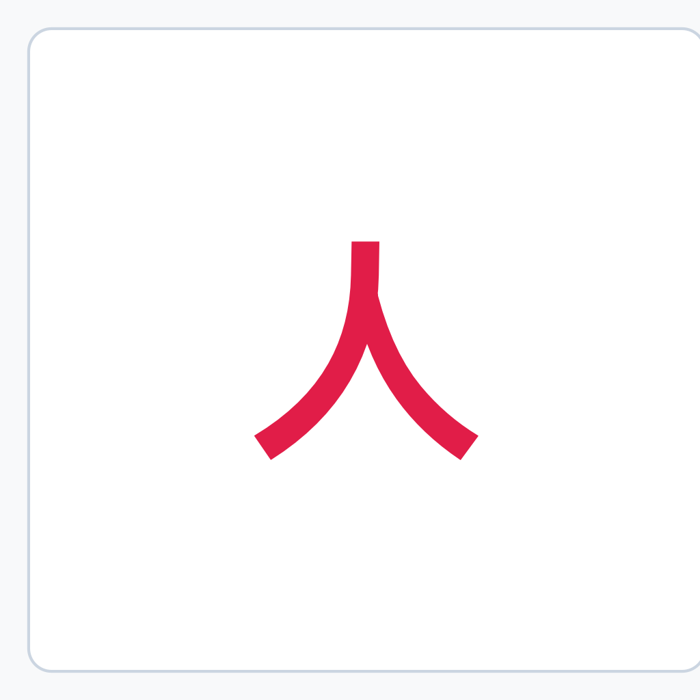
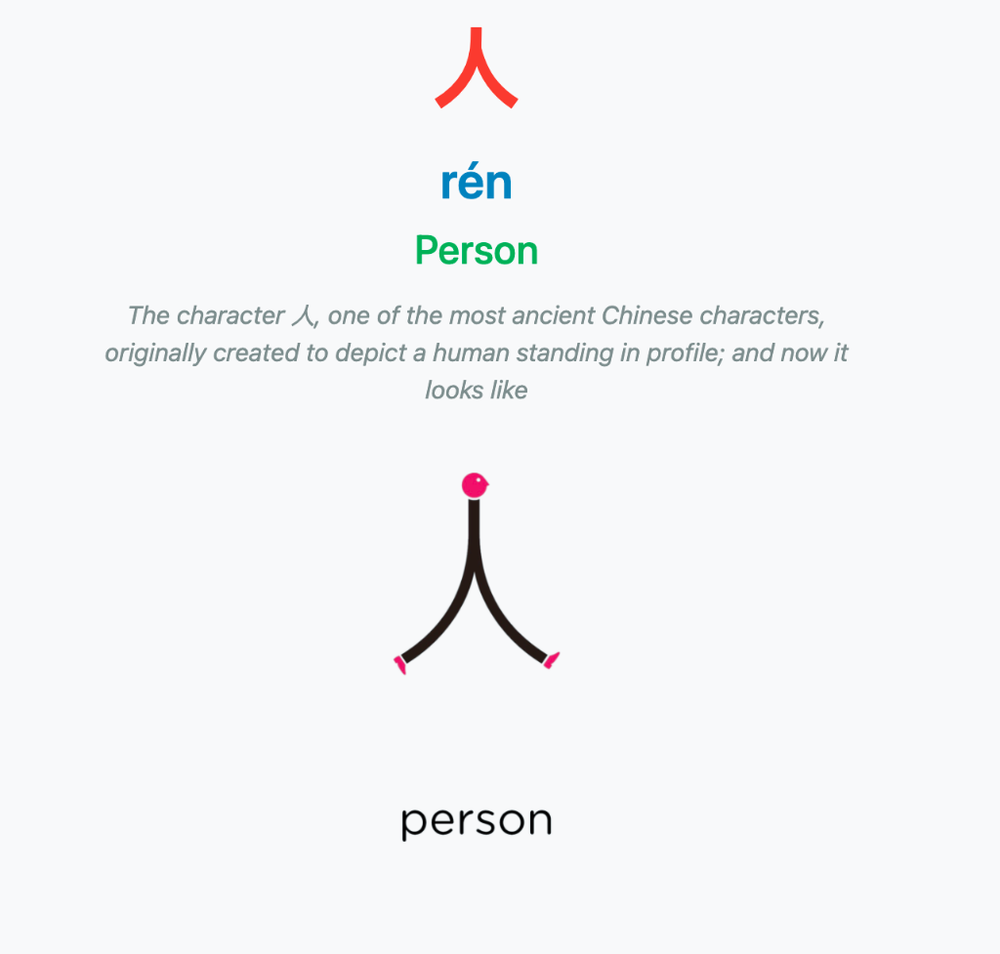

# Chineasy to Anki Studio

Module de traitement d'images, d'extraction OCR et d'importation automatique de cartes Anki à partir de captures d'écran de l'application Chineasy.

---

## 1. Objectif & Utilité

L'objectif unique de cet outil est d'automatiser la création de cartes Anki à partir de captures d'écran de l'application mobile et tablette **Chineasy**.

### Prise en charge des deux modes de captures :

1. **Cartes Chineasy Classiques (Paires de 2 captures)** :
   - Capture 1 : Illustration mnémotechnique visuelle.
   - Capture 2 : Fiche de détail avec composition du caractère, Pinyin, traduction et phrase explicative.
2. **Cartes "Word of the Day" (Capture unique combinée)** :
   - 1 seule capture d'écran contenant simultanément l'illustration en haut et l'explication lexicographique en bas.

### Fonctionnalités principales :

- **Extraction 100% Dynamique** : Analyse OCR automatique par EasyOCR sans aucun dictionnaire ni texte codé en dur.
- **Accélération Matérielle Apple Silicon (MPS GPU)** : Exploitation du processeur graphique Metal des puces Mac M1/M2/M3/M4 pour une rapidité d'extraction optimale.
- **Détourage Transparent** : Isolation automatique des illustrations mnémotechniques et suppression du fond coloré (PNG transparent).
- **Prononciation Audio HD Mandarin** : Récupération des enregistrements natifs humains avec respect des 4 tons via les API de dictionnaire (Youdao / Baidu).
- **Génération Automatique de 2 Cartes par Note Anki** :
  1. **Reconnaissance Visuelle** : Caractère Hanzi au recto -> Verso complet (Pinyin, Son HD, Traduction, Explication, Illustration).
  2. **Écoute & Écriture** : Audio seul au recto + champ de saisie acceptant le Pinyin OU les caractères chinois (Hanzi) + tableau blanc HTML5 (Canvas) pour dessiner les traits -> Correction au verso.
- **Rendu Adaptatif Light Mode & Dark Mode** : Support du mode clair et du mode nuit (`#2c2c2c`) pour la zone de saisie, le canvas et la typographie.
- **Auto-Correction des Coquilles OCR** : Récupération automatique du titre anglais propre sur l'illustration mnémotechnique pour auto-guérir les erreurs d'OCR sur les fiches de détail.

---

## 2. Prérequis & Installation

### Prérequis

1. Python 3.10 ou version supérieure.
2. macOS (avec support natif Apple Silicon GPU via Metal MPS) ou Linux / Windows.
3. Anki Desktop ouvert avec l'extension AnkiConnect (Code d'extension Anki : 2055492159).

### Installation

```bash
# 1. Accéder au dossier du projet
cd anki_characters/chineasy_to_anki

# 2. Créer et activer l'environnement virtuel Python
python3 -m venv .venv
source .venv/bin/activate

# 3. Installer les dépendances
pip install -r requirements.txt
```

---

## 3. Utilisation

### Mode Ligne de Commande (CLI)

Placez vos captures d'écran dans un sous-dossier de `captures/` (par exemple `captures/20_07_2026`), puis lancez :

```bash
python main.py captures/20_07_2026
```

Le script traite les images, génère les fichiers audio et média, synchronise les cartes directement dans Anki Desktop via AnkiConnect, puis renomme le dossier traité avec le suffixe `_PROCESSED`.

### Mode Interface Web (GUI)

```bash
python app.py
```

Ouvrez votre navigateur à l'adresse : `http://127.0.0.1:5001`

---

## 4. Architecture & Fallbacks

| Composant | Bibliothèques & Outils | Fonctionnement & Fallbacks |
| :--- | :--- | :--- |
| **Accélération** | PyTorch (MPS / Metal) | GPU Apple Silicon (M1/M2/M3/M4) avec variable `PYTORCH_ENABLE_MPS_FALLBACK=1`. Fallback : CUDA / CPU. |
| **OCR** | easyocr, pypinyin, re | Regroupement par lignes Y. Fusion des caractères CJK adjacents. Pinyin généré automatiquement. |
| **Traitement Image** | Pillow, opencv-python, numpy | Échantillonnage 4 coins, masque de distance RGB, masquage UI iOS et découpage adaptatif Word of the Day. |
| **Appariement** | Python (card_matcher) | 1. Cartes Word of the Day combinées. 2. Séquence adjacente (N-1). 3. Mot-clé anglais avec auto-correction. |
| **Audio** | requests, edge-tts, gTTS | 1. Dictionnaire Youdao HD (voix humaines studio). 2. Baidu Speech. 3. Fallback Edge-TTS (-20%). 4. gTTS. |
| **Export Anki** | requests, genanki | 1. AnkiConnect (ports 8766 / 8765) avec dédoublonnage strict. 2. Paquet autonome genanki (.apkg). |

---

## 5. Exemple Pratique d'Utilisation

### Carte Anki Générée (Recto vs Verso pour le caractère 人)

| RECTO (Front) : Caractère Seul | VERSO (Back) : Fiche Complète avec Illustration |
| :---: | :---: |
|  |  |

### Déroulement du Traitement

1. Déposer les captures d'écran dans `captures/session_demo/` :
   - `captures/session_demo/IMG_9214.PNG` (Illustration)
   - `captures/session_demo/IMG_9215.PNG` (Détail)
   - `captures/session_demo/IMG_9999.PNG` (Word of the Day pour 吃)

2. Exécuter la commande :
   ```bash
   python main.py captures/session_demo
   ```

3. Résultat obtenu dans le deck Anki `chinois::chineasy_characters` :
   - **Carte 1 (Reconnaissance Visuelle)** : Hanzi au recto -> Verso avec Pinyin, Audio HD natif, Traduction, Explication complète avec retours à la ligne exacts, et l'image mnémotechnique détourée transparente.
   - **Carte 2 (Écoute & Écriture)** : Lecture audio au recto + zone de saisie acceptant le Pinyin OU les caractères chinois (Hanzi) + tableau blanc HTML5 pour tracer le caractère -> Verso avec la correction complète.
   - Le dossier `captures/session_demo` est automatiquement renommé en `captures/session_demo_PROCESSED`.
