# Leçon 1

Source : [Le Chinois Facile](https://www.lechinoisfacile.fr/cours/lecons-gratuites/lecon/lecon-1/)
## 第一课

## dì yī kè

<audio controls src="audio/ordre_0_1_numlecon_new.mp3"></audio>

## Les 6 traits de base

Aujourd’hui, nous allons commencer par les **6 traits de base** qui sont le **fondement** de l’écriture chinoise.

Comme la langue chinoise est une langue **pictographique** et **idéographique**, les Chinois tracent des **traits** pour écrire.

Les traits sont des **tracés** que tracent les Chinois dans un **sens prédéfini**. Du point de vue de leur fonction les traits sont **les équivalents** des lettres de l’alphabet dans les langues occidentales.

Dans l’écriture chinoise on ne dénombre que **6 traits** que je nomme « **de base** » alors que dans les langues occidentales il existe **26 lettres**. Les voici :

Par exemple : 木 (mù) qui veut dire « **arbre** » et 林 qui veut dire « **forêt** ».

Le caractère 木 est composé de 4 traits :

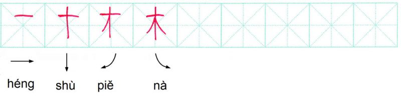

Pour les Chinois, 2 arbres font la forêt 林 ! De ce point de vue je qualifie le chinois **d’idéographique**.

C’est facile à comprendre comme idée, non ?

### Le 1er trait : héng

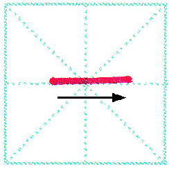

<audio controls src="audio/ordre_1_Lecon1_1_heng2.mp3"></audio>Générique 

**héng** : il s’agit d’un tracé **horizontal**, on le trace **de gauche à droite**.

### Le 2ème trait : shù

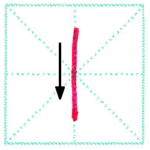

<audio controls src="audio/ordre_2_Lecon1_2_shu4.mp3"></audio>

**shù** : il s’agit d’un tracé vertical, on le trace de haut en bas.

Avec ces 2 premiers traits on peut déjà écrire notre 1er caractère : 十 shí = « **dix** ».

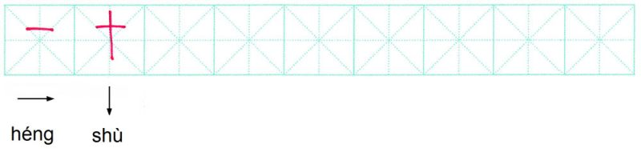

<audio controls src="audio/Lecon1_3_shi2.mp3"></audio>

### Le 3ème trait : diǎn

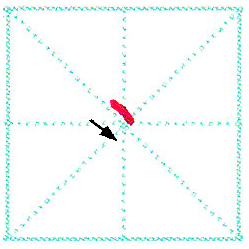

<audio controls src="audio/ordre_4_Lecon1_4_dian3.mp3"></audio>

**diǎn** : c’est un petit bout. On le trace **de haut en bas** comme l’accent grave en français.

### Le 4ème trait : tí

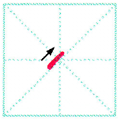

<audio controls src="audio/ordre_5_Lecon1_5_ti2.mp3"></audio>

**tí** : il s’agit d’un petit tracé **vers le haut**, mais plus long que **diǎn 丶**.

### Le 5ème trait : piě

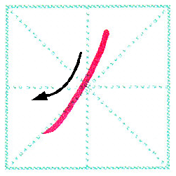

<audio controls src="audio/ordre_6_Lecon1_6_pie3.mp3"></audio>

**piě** : il s’agit d’une petite courbe **inclinée vers la gauche**.

### Le 6ème trait : nà

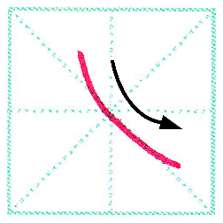

<audio controls src="audio/ordre_7_Lecon1_7_na4-1.mp3"></audio>

**nà** : il s’agit d’une petite courbe **inclinée vers la droite**.

Avec ces 2 derniers traits, on peut déjà écrire notre 2ème caractère 人 rén = « **homme** ».

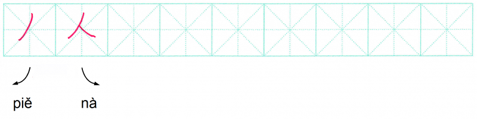

<audio controls src="audio/Lecon1_8_ren2.mp3"></audio>

Il représente un homme stylisé, debout sur ses deux jambes.

À part ces 6 traits de base, il existe une quinzaine de variantes que nous étudierons dans notre prochaine leçon. C’est un peu normal. En effet il existe 26 lettres en français pour composer des mots par dizaines de milliers.

À titre indicatif, vous n’avez pas forcément besoin de savoir prononcer l’intitulé de ces 6 traits de base. Ce qui compte pour vous c’est arriver à les dessiner. 

**_Note culturelle_ :** D’après les fouilles archéologiques, les premiers caractères ont été gravés sur des carapaces de tortues et sur des lamelles de bambou. L’apparition des premiers caractères (ou sinogrammes) remonte à la dynastie des Shang il y a plus de 3 000 ans. Ces caractères mis au jour à la suite des fouilles archéologiques étaient très figuratifs. Ils représentaient graphiquement un **objet**, un **être humain** ou un **animal**.

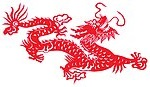

Par exemple **l’homme** que nous venons de voir :

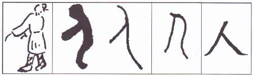

## EXERCICES

Commençons dès maintenant votre premier exercice de l’écriture chinoise.

Imprimez la page d’écriture et entraînez-vous à tracer les 6 traits de base et les 2 caractères que vous avez appris 十 et 人.

Écrivez chacun d’eux une dizaine de fois en respectant bien **l’ordre** et **le sens des traits**.

Il n’y a rien de plus **simple** pour tracer les 6 traits de base comme moi. Le héng (le 1er des 6 traits de base) se trace **de gauche à droite**. Le shù (le 2ème des 6 traits de base) se trace de **haut en bas**.

Et ensuite, essaie de générer le même type de carte que celle qu'on a faite, mais pour leçon 2. 

### Choisissez la réponse juste.

Les traits de base sont-ils les équivalents des lettres de l’alphabet dans les langues occidentales ?

- Oui
- Non
- 不知道 (je ne sais pas)

Remettez à leur place les deux caractères que vous avez appris aujourd’hui. (Saisissez le chiffre correspondant à chaque caractère) :

1. 人
2. 十

En chinois le nombre 10 s’écrit : ______

En chinois l’homme s’écrit : ______

Pour être sincère avec vous, ce que vous avez accompli en ce jour revient à avancer un **pas de géant vers la lune**. Vous avez de quoi être fiers si vous êtes grand débutants ou faux-débutants.