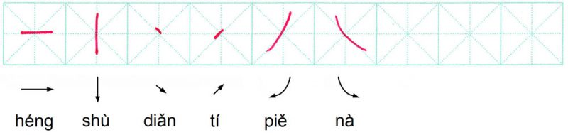
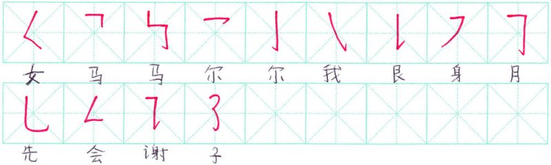
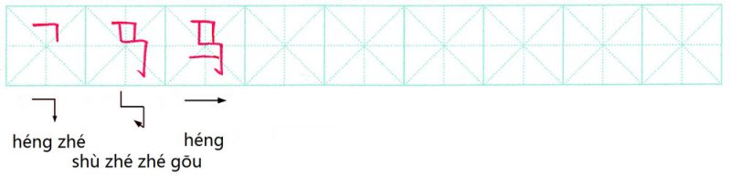
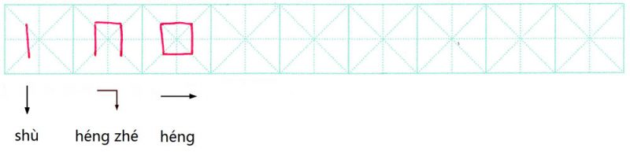
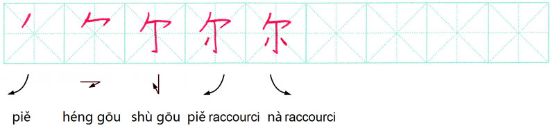

# Leçon 2

Source : <https://www.lechinoisfacile.fr/cours/lecons-gratuites/lecon/lecon-2/>

# 第二课

# dì èr kè

<audio controls src="audio/ordre_0_2_numlecon_new.mp3"></audio>

# Les variantes des traits de base

6 traits de base

Comme les 6 traits de base ne suffisent pas à composer tous les caractères chinois, les Chinois ont créé des variantes à partir des 6 traits de base. Il en existe une vingtaine.

Parmi celles-ci :

S’agissant des successions de traits de base, les variantes sont les combinaisons issues de 6 traits de base.

Ne vous inquiétez pas, il n’est absolument pas nécessaire de savoir comment ça se dit, ces variantes.

Exemples :

-Le caractère 马 qui signifie “cheval” est composé de 3 traits : 2 variantes et le trait horizontal. Il représente un cheval stylisé.

<audio controls src="audio/ordre_1_Lecon2_1_ma3.mp3"></audio>

-Le caractère 口 qui signifie “bouche” est composé de 3 traits : le trait vertical, 1 variante et le trait horizontal. Il représente une bouche ouverte stylisée.

<audio controls src="audio/ordre_2_Lecon2_2_kou3.mp3"></audio>

-Le caractère 尔 qui signifie “tu” est composé de 5 traits. Il s’agit d’une forme ancienne de “tu”. Aujourd’hui, le caractère pour dire “tu” est légèrement différent.

<audio controls src="audio/ordre_3_Lecon2_3_er3.mp3"></audio>

Vous apprendrez toutes les variantes au fil des leçons.

Note culturelle : Comme les 6 traits de base ne suffisent pas à composer tous les caractères, nos ancêtres ont créé les variantes.
En chinois il existe environ 10 000 caractères parmi lesquels 1 000 sont les plus courants. Rassurez-vous, vous n’aurez pas besoin de connaître 10 000 caractères pour arriver à communiquer. 1 000 caractères et mots vous suffiront pour que vous puissiez vous débrouiller dans des différentes situations.
A l’issue du programme Pack Complet (107 leçons) au bout d’un an d’apprentissage vous aurez appris approximativement 1 800 caractères et mots.

# EXERCICES

Et maintenant, c’est à vous ! Voici votre deuxième exercice de l’écriture chinoise.

Imprimez les pages d’écriture téléchargeables et entraînez-vous à tracer les 13 variantes ainsi que les caractères que vous avez appris aujourd’hui : 马, 口 et 尔.

Ecrivez chacun d’eux 5 fois en respectant bien l’ordre et le sens des traits.

A titre indicatif: Chaque variante doit être tracée en une seule fois, sans lever le crayon lors du changement de la direction du trait.

Ce que vous avez à faire c’est me suivre pas à pas. Tout le monde va y arriver.

Limite de Temps: 0

#### Résumé de Quiz

0 of 3 Questions completed

Questions:

#### Information

You have already completed the quiz before. Hence you can not start it again.

Quiz is loading…

You must sign in or sign up to start the quiz.

Vous devez d’abord complété le suivant :

#### Résultats

Quiz complete. Results are being recorded.

#### Résultats

0 of 3 Questions answered correctly

Your time:

Temps écoulé

You have reached 0 of 0 point(s), (0)

Earned Point(s): 0 of 0, (0)
0 Essay(s) Pending (Possible Point(s): 0)

#### Catégories

- Pas classé 0%

-

- 1

- 2

- 3

- Current

- Révision

- Répondu

- Exact

- Inexact

- Question 1 of 3

##### 1. Question

### Choisissez la bonne réponse.

Les variantes sont-elles issues des 6 traits de base ?

- [ ] Oui

- [ ] Non

- [ ] 不知道 (je ne sais pas)

Exact Inexact

- Question 2 of 3

##### 2. Question

### Choisissez la bonne réponse.

Combien de variantes existe-t-il dans le caractère 马 ?

- [ ] Une

- [ ] Deux

- [ ] Trois

- [ ] 不知道 (je ne sais pas)

Exact Inexact

- Question 3 of 3

##### 3. Question

### Associez chaque caractère avec sa signification.

1) 十 2) 人 3) 木 4) 马 5) 口

-

Homme : ______

Cheval : ______

Dix : ______

Bouche : ______

Arbre : ______

Exact Inexact
